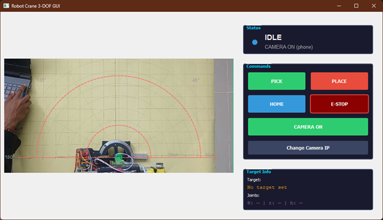
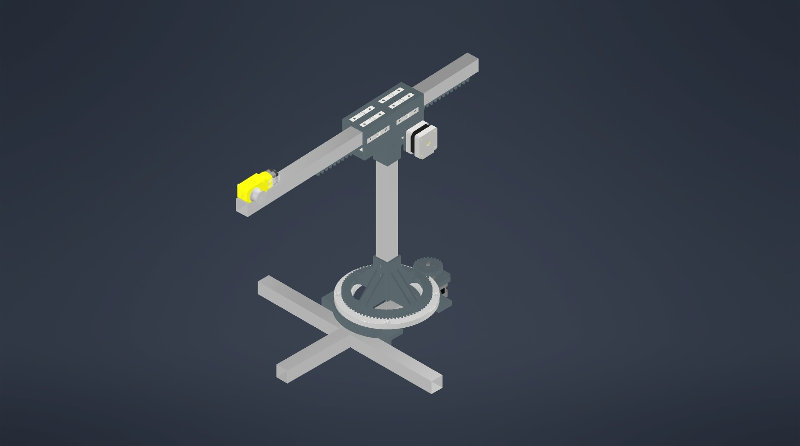

# Robot Crane 3-DOF GUI Controller
GUI dan firmware kontrol untuk **Robot Crane 3-DOF berbasis ESP32/Arduino + PyQt5** yang menggunakan **Inverse Kinematics (IK)** untuk mengubah koordinat target menjadi gerakan aktuator.

Robot dirancang untuk memindahkan objek logam menggunakan **end effector magnetik** dengan kontrol posisi berbasis koordinat kartesian.

---

## Features

### Desktop GUI (PyQt5)

_GUI photo_
- Interactive crane workspace canvas
- Klik target langsung pada area kerja
- Konversi otomatis koordinat kartesian → joint space (IK)
- Kontrol:
  - **Pick**
  - **Place**
  - **Home**
  - **Emergency Stop**
- Status indikator robot:
  - `IDLE`
  - `MOVING`
  - `DONE`
  - `ERROR`
- Auto serial connection
- Feedback posisi dari mikrokontroler
- IP Camera integration (Android IP Webcam)

### Robot Control

- **3-DOF Crane**
  - Joint 1 → Revolute (Yaw / Rotation)
  - Joint 2 → Prismatic (Horizontal slider)
  - Joint 3 → Hoist / vertical movement
- **Inverse Kinematics**
  - Cartesian `(x, y)` → `(θ, r, h)`
- Workspace validation
- Joint limits protection
- Emergency stop support

### Embedded Firmware
- Stepper motor control with `AccelStepper`
- JSON-based serial communication
- Homing system using limit switch
- Motion sequencing
- DC motor hoist control

---

## System Architecture

```text
User Click on GUI
        ↓
Canvas Coordinate
        ↓
Cartesian Coordinate (x, y)
        ↓
Inverse Kinematics
        ↓
(theta, r, h)
        ↓
JSON Serial Communication
        ↓
ESP32 / Arduino
        ↓
Motor Driver Control
        ↓
Robot Movement
```
## Robot Configuration
### Degrees of Freedom

|Joint |	Type        |Function                   |
|:---  |:---            |:---                       |
|Joint 1|	Revolute    |	Rotasi crane (yaw)      |
|Joint 2|	Prismatic   |	Gerak horizontal slider |
|Joint 3|	Hoist	    |Naik turun end effector    |

### End Effector

Magnet yang digunakan untuk mengambil objek logam dan dipasang dengan mekanisme tali pada sistem hoist.

## Project Structure

```text
├── assets/
│   ├── GUI.png
│   └── robot_design.jpeg
│
├── src/
│   └── main.cpp               # Firmware mikrokontroler
│
├── canvas_widget.py           # Canvas GUI & kamera
├── control_panel.py           # Panel kontrol GUI
├── kinematics.py              # Inverse kinematics
├── serial_comm.py             # Komunikasi serial
├── main_window.py             # Main GUI window
├── params.py                  # Konfigurasi sistem
├── test_serial.py             # Testing serial
├── platformio.ini             # Konfigurasi PlatformIO
└── README.md
```
## Inverse Kinematics

Robot menggunakan model inverse kinematics sederhana:
$$
θ=atan2(y,x)
$$	​
$$
r=x^2+y^2
$$	​
$$
h= \text{target height}
$$

Dimana:
```text
θ → sudut rotasi crane
r → panjang radial slider
h → tinggi hoist
```
Workspace dan joint akan divalidasi terhadap batas fisik robot.

## Joint Limits

Default limits berada pada params.py:
```
THETA_LIMITS = (2, 178)
R_LIMITS = (13, 33)
H_LIMITS = (2, 28)
```
## Hardware Requirements
### Main Components
```
ESP32 / Arduino-compatible board
2x Stepper Motor
Driver stepper (A4988 / DRV8825)
1x DC Motor (hoist)
Motor driver DC
Limit switch x2
Electromagnet end effector
Android phone (optional IP webcam)
Software Requirements
```

### Install dependency:

```bash 
pip install pyqt5 pyserial
```

Optional:
```bash
pip install opencv-python
```
### Running Desktop GUI

Jalankan:
```bash
python main_window.py
```

GUI akan:

1. Membuka workspace robot
2.  Attempt auto-connect serial
3. Menampilkan status koneksi
4. Siap menerima target klik
5. Serial Configuration

Konfigurasi serial berada di:

```
params.py

COM_PORT = "COM12"
BAUD_RATE = 9600
USE_SERIAL_FEEDBACK = True
```

Sesuaikan `COM_PORT` dengan device yang digunakan.

Contoh:
```
Windows:

COM_PORT = "COM7"
```
```
Linux:

COM_PORT = "/dev/ttyUSB0"
```
### Communication Protocol

Komunikasi GUI ↔ mikrokontroler menggunakan newline-delimited JSON.
```JSON
MOVE Command
{
  "command": "MOVE",
  "theta": 90,
  "r": 20,
  "h": 10,
  "magnet": true
}
```
```JSON
HOME Command
{
  "command": "HOME"
}
```
```JSON
Emergency Stop
{
  "command": "ESTOP"
}
```
```JSON
Status Request
{
  "command": "STATUS"
}
```
### Firmware Build

Menggunakan PlatformIO.

Build
```
pio run
````
Upload
```
pio run --target upload
```
Serial Monitor
```
pio device monitor
```
### Current configuration:

```
board = esp32dev
framework = arduino
monitor_speed = 115200
```

## Camera Integration

Robot mendukung kamera dari HP menggunakan aplikasi **IP Webcam**.

Konfigurasi di:
```python
IP_CAMERA_URL = "http://192.168.x.x"
```
Robot akan menampilkan live camera feed di GUI canvas.

## Safety Features
- Joint limit validation
- Workspace validation
- Homing system
- Emergency stop
- Idle timeout
- Serial disconnection detection
## Current Limitations
- Belum ada trajectory planning
- Motion masih point-to-point
- Collision avoidance belum tersedia
- Belum ada visual object detection
- Kamera masih sebagai monitoring, bukan feedback kontrol
## Future Development
- Object detection dengan OpenCV
- Camera calibration
- Trajectory smoothing
- Real-time feedback control
- PID motion refinement
- Multi-point path planning
- ROS integration
## Authors
_Teknik Elektro, Universitas Negeri Yogyakarta_
- Angga Satriawan Aldi
- Ahmad Fauzan
- Muhammad Hilman Hanif

### Built with:

- Python (PyQt5)
- PlatformIO
- Arduino Framework
- ESP32